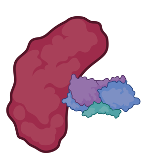

# HVIface_MMAD

HVIface is a deep learning framework designed to predict interaction interfaces between two protein sequences in human–virus systems.

----
## 
 HVIface: Human–Virus Interaction Interface Predictor

**HVIface** is a deep learning–based framework designed to predict **interaction interfaces** between two protein sequences in human–virus systems.  
It identifies which residues in each protein are most likely to participate in binding, enabling better understanding of host–pathogen interactions.

---

### 🔍 Overview

HVIface takes two protein sequences as input and predicts their potential interaction sites using trained deep learning models.

---

### ⚙️ Workflow

1. **Input Sequences**  
   - Human protein sequence  
   - Viral protein sequence  

2. **Feature Extraction**  
   - Physicochemical properties  
   - Evolutionary information (PSSM, etc.)  
   - Structural predictions  

3. **Deep Learning Model**  
   - Learns interaction patterns from known protein complexes  

4. **Prediction Output**  
   - Residue-level interaction interface  
   - Binding probability scores  

---

### Model Insight

- Uses advanced neural networks to capture sequence–interaction relationships  
- Predicts **interface residues** rather than just binary interaction  

---

### Applications

- Host–virus interaction studies  
- Drug target identification  
- Vaccine design  
- Functional annotation of proteins  

---

### Key Advantage

Unlike traditional methods, **HVIface** focuses on **residue-level interface prediction**, providing deeper biological insights into protein–protein interactions.

---

## HVIface Tutorial

Follow the steps below to perform interface prediction:

### 1. Feature Generation
Compile 18 features for the two input protein sequences.  
Refer to the **CoRNeA tutorial** for detailed instructions:
- `CoRNeA_tutorial.pdf`

---

### 2. Load the Trained Model
Load the pre-trained model:
- `HVIface_model.keras`

Use the provided notebook:
- `ANN_Oversampling_under_testing_final_18_06_2024-Copy1.ipynb`

---

### 3. Perform Prediction
Run the notebook to predict pairwise residue interactions between the two protein sequences.

---

### 4. Post-processing
Follow the **CoRNeA tutorial** for post-processing steps:
- Filtering predictions  
- Generating interaction networks  
- Refining interface residues  

---

### 5. Output
- The predicted pairwise interactions are generated in **CSV format**
- Results can be sorted based on **convolution scores** to identify high-confidence interactions

---

## Additional Resources

- Validation data:  
  https://github.com/krishnakantgupta-ai/HVIface_MMAD/tree/main/Validation

---

## Notes

- The model uses **SMOTE-based imbalance handling**
- Training incorporates **early stopping for optimal performance**
- Designed specifically for **human–virus protein interaction interfaces**

---
